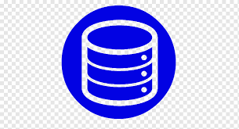

# DataCamp
Learning Data Science from Datacamp Modules, the career tracks I have completed are noted below, as well as those in progress. The last section (and likely of most interest includes links to the individual skill certificates I have obtained in a language x language breakdown. The percent next to the emoji indicates the percent of skill tracks I have completed in that language out of all those I have completed.

# Career Tracks Completed 
- Git ✅

- R for Data Science ✅

- Python for Data Science ✅

# Career Tracks in Progress

- Quantitative Analysis with R 📈

# Language Breakdown

- [Tableau Courses](Certificates/Tableau) 📊 (20%)

- [Python Courses](Certificates/Python) 🐍 (20%)

- [R Courses](Certificates/R)   (50%)

- [SQL Courses](Certificates/SQL)  (10%)